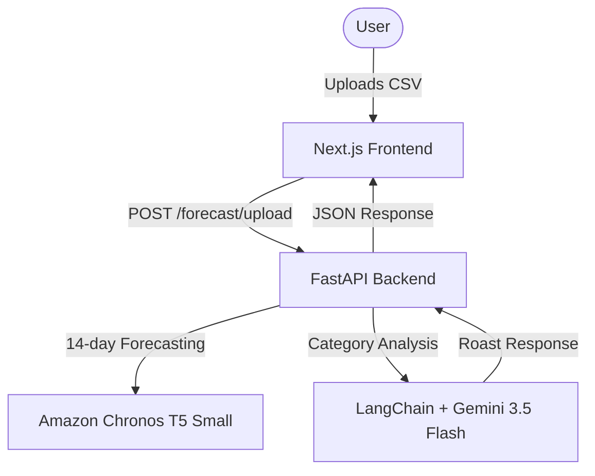
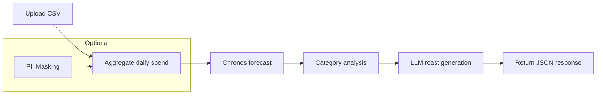

# FinRoast Project Documentation

Welcome to **FinRoast**, a proactive financial intervention platform that uses zero-shot time-series forecasting to predict spending behavior and an LLM guardrail system to generate sarcastic financial roasts.

---

## 🏗️ Architecture & Component Overview



### 1. Backend (`FastAPI`)
* **Location:** Root directory files (`main.py`, `roaster.py`).
* **Port:** Runs locally on `http://localhost:8055`.
* **Chronos Forecasting (`main.py`):** Uses the pre-trained `amazon/chronos-t5-small` model to generate 10th, 50th, and 90th percentile forecasts for the next 14 days based on daily spending totals.
* **LLM Roast Generation (`roaster.py`):** Utilizes `langchain-google-genai` with `gemini-3.5-flash` to analyze transaction categories and forecast spikes to generate a roast. It leverages custom runnables and Pydantic output parsers to enforce structured schema conformance.

### 📊 Calculations Logic & Flow

The backend performs two core calculations:

1. **Time‑Series Forecasting (Chronos)**
   - `main.py` loads the pre‑trained `amazon/chronos-t5-small` model.
   - The uploaded CSV is aggregated by date to produce a daily spend series.
   - The model receives the series and returns the 10th, 50th, and 90th percentile forecasts for the next 14 days.
   - Results are wrapped in a `ForecastResult` Pydantic model and returned in the API response.

2. **LLM Roast Generation**
   - `roaster.py` receives the forecast and the categorized transaction summary.
   - It builds a prompt that describes spending spikes and asks Gemini 3.5 Flash to generate a sarcastic roast.
   - A custom `Runnable` and `OutputParser` enforce the response schema:
     ```json
     { "roast": "string" }
     ```
   - The roast is injected into the final JSON payload.

Optional **PII Masking** (if enabled):
   - `pii_masker.py` scans the raw CSV for personally identifiable information using regex patterns.
   - Detected fields are replaced with `***` before any further processing.

The overall flow can be visualized as:



This section clarifies the calculation pipeline that powers the API response.

### 2. Frontend (`Next.js`)
* **Location:** `/frontend` directory.
* **Port:** Runs on `http://localhost:3055` (configurable).
* **Stack:** Next.js (App Router), TypeScript, Tailwind CSS, Lucide icons, and Recharts (for continuous history and forecast plotting).

---

## 📂 File Directory Map

```text
finroast/
├── main.py                     # Main FastAPI application server & routes
├── roaster.py                  # LangChain logic for Gemini AI financial roasts
├── schema.json                 # JSON schema validating the backend responses
├── requirements.txt            # Python dependencies (FastAPI, PyTorch, Chronos, etc.)
├── synthetic_transactions.csv  # Mock CSV transaction file for testing
├── list_models.py              # Debug utility to list available Gemini models
├── test_chronos.py             # Sandbox script to run standalone Chronos inference
├── verify_backend.py           # Verification script simulating frontend file upload
├── .env.example                # Example configuration template for environment secrets
├── .env                        # Local environment file containing API keys (ignored by git)
├── .gitignore                  # Git blocklist (excludes .env, venv, and cache files)
└── frontend/                   # React web application workspace
    ├── package.json            # Node.js dependencies (Next.js, Tailwind, Recharts)
    └── src/
        └── app/
            ├── layout.tsx      # Main HTML layout wrapper
            ├── globals.css     # Global CSS rules (Tailwind variables)
            └── page.tsx        # Dashboard page hosting CSV upload & charts
```

---

## 🔌 API Endpoints

### `POST /forecast/upload`
Uploads a transaction CSV file and returns historical records, 14-day forecasts, and a structured roast.

* **Payload Format:** `multipart/form-data` containing a `file` field.
* **CSV Requirements:** Must contain columns `Date`, `Amount`, and `Category`. Expenses must be positive values (income ≤ 0 is filtered out).
* **JSON Response Schema (`schema.json`):**
```json
{
  "historical": [
    { "date": "YYYY-MM-DD", "amount": 12.50 }
  ],
  "forecast": [
    { "date": "YYYY-MM-DD", "p10": 10.00, "p50": 20.00, "p90": 45.00 }
  ],
  "roast": "Sarcastic AI roast text based on the uploaded data."
}
```

---

## ⚙️ Installation & Local Development

### 1. Backend Setup
1. Create a Python virtual environment:
   ```bash
   python3 -m venv venv
   source venv/bin/activate
   ```
2. Install Python dependencies:
   ```bash
   pip install -r requirements.txt
   ```
3. Set up your Gemini credentials:
   ```bash
   cp .env.example .env
   # Add your Gemini API key to GEMINI_API_KEY
   ```
4. Run the FastAPI development server:
   ```bash
   python3 main.py
   ```

### 2. Frontend Setup
1. Navigate to the frontend directory:
   ```bash
   cd frontend
   ```
2. Install Node packages:
   ```bash
   npm install
   ```
3. Run the Next.js development server:
   ```bash
   npm run dev -- -p 3055
   ```
